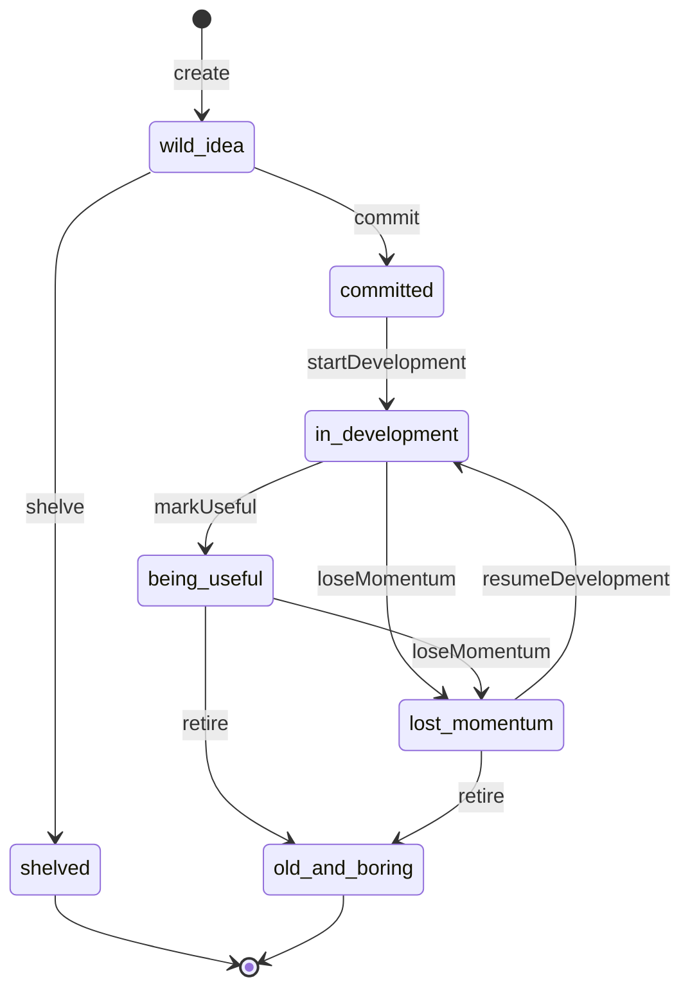
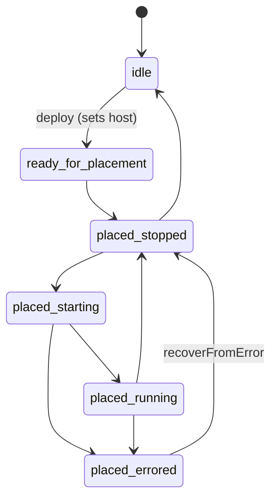

# homelab-project-manager

A [swamp](https://github.com/swamp-club/swamp) extension that models a single
**home-lab project** as a swamp model instance — tracking it from a half-formed
idea all the way through to a deployed, running (or retired) service.

Extension type: `@shelson/homelab-project`

## What this is

A home-lab project is fluid: an idea you might shelve, a repo you commit to, a
docker-compose service you eventually place on some box, run for a while, and
maybe let rot. This model captures that whole arc as **two independent state
machines** on one project record, with every transition guarded by a pre-flight
check and the full history preserved automatically as versioned resource data
(no separate audit log).

Each project is **one model instance** (factory pattern) — e.g. one instance
per `media-server`, `paperless`, `home-assistant`. Methods on different projects
run concurrently; there is no shared "registry" instance.

## The two state machines

### Lifecycle — where the *idea/project* is in its life



`shelved` and `old-and-boring` are **terminal** — no method runs on a project in
either state. The graph is deliberately **revivable**: `resumeDevelopment` pulls
a stalled project back into `in-development`.

### Deploy — where the *running service* is



`deploy` is the only edge out of `idle` (it also assigns `host`). Beyond that,
movement is driven by `setDeployState <target>`, a manual escape hatch validated
against `LEGAL_DEPLOY_TRANSITIONS` — it stands in for real placement automation
until that exists. `retire` auto-resets a still-placed project back to `idle`.

## Methods

| Method | Effect | Legal from |
| --- | --- | --- |
| `create` | Capture a wild idea (title + optional notes) | (no instance yet) |
| `commit` | Attach a repository, move to `committed` | `wild-idea` |
| `startDevelopment` | Move to `in-development` | `committed` |
| `markUseful` | Move to `being-useful` | `in-development` |
| `loseMomentum` | Move to `lost-momentum` | `in-development`, `being-useful` |
| `resumeDevelopment` | Revive to `in-development` | `lost-momentum` |
| `retire` | Move to `old-and-boring`, un-place if needed | `being-useful`, `lost-momentum` |
| `shelve` | Move to `shelved` | `wild-idea` |
| `addCompose` | Record path to the project's `compose.yaml` | repo attached |
| `deploy` | Target a host → `ready-for-placement` | repo + compose present |
| `recoverFromError` | Errored → `placed-stopped` | `placed-errored` |
| `setDeployState` | Manual deploy-state move along a legal edge | per `LEGAL_DEPLOY_TRANSITIONS` |

The `state` resource holds the full record: title, research notes, both states +
timestamps, repository, compose path, host, and a transition note.

## Layout

```
extensions/models/
  homelab_project.ts        # model export: type, resource, 12 methods, 11 checks
  _lib/homelab_project.ts   # shared schemas, enums, transition tables, helpers
```

`setDeployState`'s transition-legality is validated **inline in `execute`**, not
as a pre-flight check, because checks do not receive per-call method `arguments`.

## Using it locally

This is an unpublished, local-only extension. From a consuming swamp repo,
register this directory as a source:

```sh
swamp extension source add /path/to/swamp-extensions/homelab-project-manager
swamp model type search homelab        # confirms @shelson/homelab-project resolves
swamp model create @shelson/homelab-project media-server
swamp model method run media-server create --input title="Media Server"
```

## Status

**Working today (v1):** the complete lifecycle + deploy state machinery, all
transition guards, and the versioned audit trail. Verified end-to-end against a
live `swamp` instance driving every edge, including illegal-transition
rejections, the revival edge, terminal-state guards, and the version history.

**Honest stubs — not faked success:**
- `commit --createNewRepo` throws "not yet implemented" (pass an existing
  `repoUrl` instead).
- `deploy` and `setDeployState` only move state; there is **no** real docker /
  SSH placement, and no filesystem checkout/cleanup on `retire`.

## Where this is heading

- **Real repo creation** — wire `commit --createNewRepo` to a GitHub extension
  (e.g. an `ensureRepo`-style method) instead of throwing.
- **Real placement** — replace the `setDeployState` test-driver with actual
  docker-compose lifecycle over SSH (likely via a community docker extension),
  so `deploy` / start / stop / recover drive real containers.
- **Host inventory** — `host` is a plain string for now (only a handful of
  boxes). If it grows, promote it to a reference into a dedicated host model.
- **Packaging** — add `manifest.yaml` / `deno.json` / license and publish, once
  the integrations above make it worth sharing.
